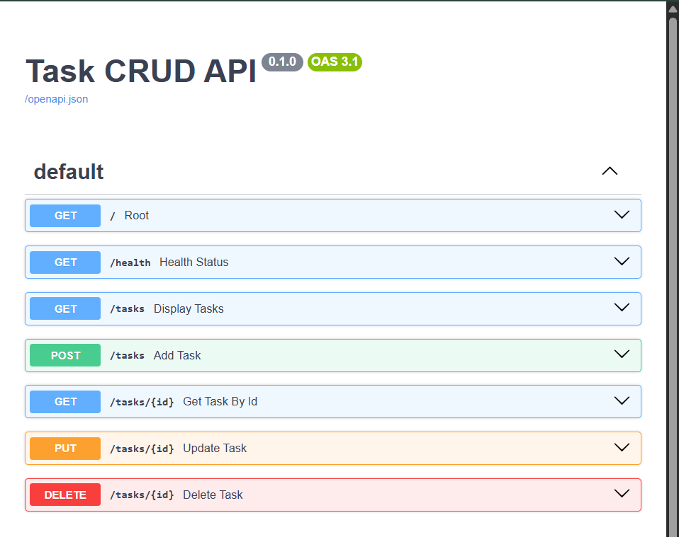

# Task CRUD API (FastAPI)

A simple CRUD REST API for managing a to-do list, built with **Python** and **FastAPI**.
Data is stored **in memory** (a plain Python list) — no database yet, so all tasks reset
whenever the server restarts. Interactive API docs are auto-generated by FastAPI via Swagger UI.

## Requirements

- Python 3.10+
- `fastapi`
- `uvicorn`

## Setup & run

```bash
# 1. Install dependencies
pip install fastapi uvicorn

# 2. Start the server
python -m uvicorn main:app --reload
```

> **Note (Windows):** if `uvicorn main:app --reload` gives you
> `The term 'uvicorn' is not recognized...`, use `python -m uvicorn main:app --reload`
> instead — this runs uvicorn as a Python module and avoids PATH issues.

The API runs at **http://localhost:8000**.

## Endpoints

| Method | Path         | Description                          |
|--------|--------------|----------------------------------------|
| GET    | `/`            | API info (name, version, endpoints) |
| GET    | `/health`      | Health check                        |
| GET    | `/tasks`       | List all tasks                      |
| GET    | `/tasks/{id}`  | Get a single task by id             |
| POST   | `/tasks`       | Create a new task                   |
| PUT    | `/tasks/{id}`  | Update an existing task             |
| DELETE | `/tasks/{id}`  | Delete a task                       |

### Status codes

| Code | Meaning                                    |
|------|---------------------------------------------|
| 200  | Successful read/update                      |
| 201  | Task created                                |
| 204  | Task deleted (no content)                   |
| 400  | Invalid input (missing/empty title)         |
| 404  | Task with that id doesn't exist             |

## Example request

```
$ curl -i http://localhost:8000/tasks/1

HTTP/1.1 200 OK
content-type: application/json

{"id":1,"title":"Task 1","done":false}
```

<!-- Replace the block above with your own actual curl -i (or Invoke-RestMethod) output -->

## Swagger UI

Interactive docs, with a "Try it out" button for every endpoint, are available at:

**http://localhost:8000/docs**



<!-- Replace swagger-screenshot.png with your actual screenshot filename, placed in the repo root -->

## Task schema

```json
{
  "id": "integer (auto-assigned)",
  "title": "string (required)",
  "done": "boolean"
}
```

## Notes

- Data lives only in memory — restarting the server resets the task list back to the 3 seeded examples.
- No database is used in this stage (that's next week's assignment).