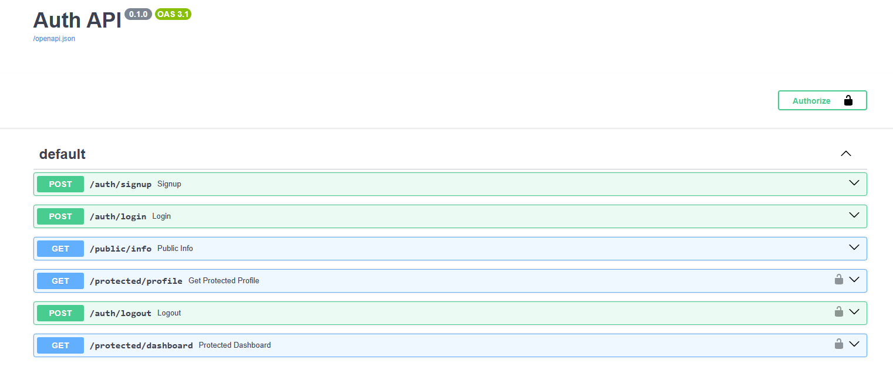

---
# Assignment 4 – Auth Login & Protect (FastAPI + Supabase)

## A4 What this assignment is about

Assignments 1–3 built a task API that anyone could read, create, or delete —
no login required. This assignment adds real authentication: signup, login,
logout, and routes that only work if you're carrying a valid access token.

Instead of writing password hashing or token signing by hand (a bad idea in
production), this uses **Supabase** as the Identity Provider (IdP). Supabase
owns the actual security-sensitive work — storing credentials safely, issuing
JSON Web Tokens (JWTs), verifying them — and this FastAPI app is the
middleman: it exposes a clean set of routes, decides what's allowed to be
asked, and translates whatever Supabase says into the right HTTP status
codes.

This lives in its own subfolder, `assignment-4-auth/`, since it's a genuinely
separate app (different purpose, different routes) rather than an evolution
of the task API from A1–A3.

## A4 The trust triangle, briefly

Three parties are involved in every authenticated request:

- **Client** — sends email/password to sign up or log in.
- **Supabase (Identity Provider)** — checks credentials, issues a JWT
  **access token** (short-lived, ~1 hour) and a **refresh token**
  (longer-lived, used to get a new access token without logging in again).
- **This backend** — receives the access token on protected routes (in an
  `Authorization: Bearer <token>` header), asks Supabase "is this genuine,
  and whose is it?", and only then lets the request through.

The access token itself is a signed, self-contained proof of identity — this
backend never has to look anything up in its own database to know who's
asking; the token's cryptographic signature is the proof.

## A4 Requirements

- Python 3.10+
- `fastapi`
- `uvicorn`
- `supabase` (the official Python SDK)
- `python-dotenv`
- A free [Supabase](https://supabase.com) project

## A4 Endpoints

| Method | Path                  | Auth required? | Description                          |
|--------|------------------------|:---------------:|----------------------------------------|
| POST   | `/auth/signup`          | No              | Create a new account via Supabase   |
| POST   | `/auth/login`           | No              | Authenticate, receive access + refresh tokens |
| POST   | `/auth/logout`          | Yes             | End the current session server-side |
| GET    | `/public/info`          | No              | Unprotected sample route            |
| GET    | `/protected/profile`    | Yes             | Verified user's id/email/created_at |
| GET    | `/protected/dashboard`  | Yes             | Second protected route, proves the auth dependency is reusable |

### A4 Status codes

| Code | Meaning                                            |
|------|-------------------------------------------------------|
| 200  | Successful login / read                                |
| 201  | Account created                                        |
| 204  | Logout successful (no content)                          |
| 400  | Missing input, or Supabase rejected the request (e.g. bad email format, rate limit) |
| 401  | Missing, malformed, invalid, or expired token; wrong login credentials |

## A4 How verification actually works

`GET /protected/profile`, `GET /protected/dashboard`, and `POST /auth/logout`
all depend on one shared function, `get_current_user`, instead of each
repeating their own token-checking logic:

```python
def get_current_user(
    authorization: str = Header(None),
    credentials = Depends(bearer_scheme),
):
    if not authorization or not authorization.startswith("Bearer "):
        raise HTTPException(status_code=401, detail="Access token required")

    token = authorization.removeprefix("Bearer ")

    supabase = get_supabase()
    try:
        response = supabase.auth.get_user(token)
    except AuthApiError:
        raise HTTPException(status_code=401, detail="Invalid or expired token")

    return response.user
```

Any route that needs a logged-in user just adds `user = Depends(get_current_user)`
as a parameter. If the token is missing or invalid, FastAPI stops the request
right there with the correct `401` — the route's own code never runs.

## A4 What actually happened, step by step

Nothing here went perfectly the first time, and rather than smooth that over,
this section documents the real problems hit and how each one was actually
solved — including a couple of genuinely wrong assumptions along the way.

**1. Two virtual environments, one project.**
Early setup created a fresh `venv` inside `assignment-4-auth/` and installed
`fastapi`, `uvicorn`, and `supabase` into it. But the repo already had a
`.venv` at the root from Assignments 1–3, and VS Code's editor/Run button
defaulted to that one — which didn't have the new packages, producing a
`ModuleNotFoundError: No module named 'supabase'` that looked like a real
bug but was actually two separate Python environments disagreeing with each
other. Fixed by standardizing on the single root-level `.venv`, reinstalling
the three packages into it, and explicitly selecting it via VS Code's
"Python: Select Interpreter."

**2. PowerShell's `curl` isn't curl.**
Testing endpoints with `curl -i -X POST ... -d '{"email":...}'` failed
repeatedly — PowerShell aliases `curl` to `Invoke-WebRequest`, which parses
flags and quotes differently from real curl. Fixed two ways: calling
`curl.exe` explicitly to bypass the alias, and writing JSON payloads to a
temporary `.json` file and passing `--data "@file.json"` instead of trying
to escape nested quotes inline — much more reliable on Windows.

**3. Supabase's example/reserved email domains get rejected.**
The very first signup test used `test@example.com` and failed with
`Email address "test@example.com" is invalid`. `example.com` is a reserved,
non-real domain per IETF standard, and Supabase blocks it outright. Switched
to a realistic-looking email format for testing.

**4. Free-tier email rate limits blocked signup entirely.**
After a couple of signup attempts, every further signup — including with a
real Gmail address — started failing with `{"detail":"email rate limit
exceeded"}`. This wasn't a bug: Supabase's free tier shares a default email
provider with a strict hourly send limit, and signup tries to send a
confirmation email as part of account creation, so hitting the limit blocks
signup itself, not just the email. Worked around by creating a user directly
through the Supabase dashboard's "Add user" panel with the confirm-on-create
option, bypassing the email step entirely for testing purposes.

**5. `sign_out()` crashed — and the fix revealed a deeper design gap.**
Calling `supabase.auth.sign_out(token)` inside the logout route crashed with
`TypeError: string indices must be integers, not 'str'`. The real cause,
confirmed against Supabase's docs: the regular client's `sign_out()` doesn't
take a token argument at all — it needs a user to already be signed in *on
that same client instance* (it operates on an in-memory session, not a
token you hand it). Since `get_supabase()` deliberately creates a fresh,
blank client on every request (no shared state between requests), there was
never a session for it to sign out of — the crash exposed a real structural
mismatch, not just a syntax error.

Fixed by switching to the **Admin API**, which acts directly on a token
using elevated `service_role` credentials instead of relying on client-side
session state:

```python
supabase_admin = get_supabase_admin()
supabase_admin.auth.admin.sign_out(token)
```

This required adding a second, more sensitive credential (`SUPABASE_SERVICE_KEY`)
to `.env`, and a second client-builder function, `get_supabase_admin()`, kept
clearly separate from the regular `get_supabase()` so it's obvious in the
code whenever elevated permissions are in use.

**6. A wrong assumption about what logout actually revokes — corrected.**
Initial assumption: logging out immediately invalidates the access token.
This is **not correct** for the standard client-side `sign_out()` — per
Supabase's own docs, that only revokes the refresh token; the access token
(JWT) stays valid until its own expiry regardless, since it's a stateless,
self-verifying signature rather than something checked against a database on
every request. However, testing showed the **admin** sign-out (the one this
project ended up using, as a side effect of fixing the crash above) behaves
more strongly — a token that had just been logged out via the admin API was
immediately rejected by `/protected/profile` with `401`, not accepted until
natural expiry. So the crash fix accidentally produced a *more* secure
logout than the textbook client-side version would have given.

## A4 Setup & Run

```bash
# 1. Create and activate a virtual environment (from the repo root)
python -m venv .venv
.venv\Scripts\activate        # Windows
# source .venv/bin/activate   # macOS/Linux

# 2. Install dependencies
pip install fastapi "uvicorn[standard]" supabase

# 3. Create assignment-4-auth/.env with:
#    SUPABASE_URL=https://your-project.supabase.co
#    SUPABASE_KEY=your_anon_key
#    SUPABASE_SERVICE_KEY=your_service_role_key   (needed for logout)
#    PORT=8000

# 4. Run the server
cd assignment-4-auth
python -m uvicorn main:app --reload
```

The API runs at **http://localhost:8000**, interactive docs at
**http://localhost:8000/docs**.

> **Note:** `SUPABASE_SERVICE_KEY` is far more powerful than the anon key —
> it bypasses normal security rules entirely. It must never be committed or
> exposed client-side; `.env` is gitignored specifically to protect this.

## A4 Swagger UI

`/docs` shows a padlock next to every route that depends on `get_current_user`
(`/protected/profile`, `/protected/dashboard`, `/auth/logout`), and no
padlock on the open routes. Clicking **Authorize** and pasting a real access
token (no `Bearer` prefix — Swagger adds that automatically) lets you test
protected routes directly from the browser.


